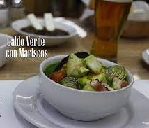

  

# BIENVENIDOS 

## **CALDO VERDE DE MARISCOS**

## *Esta receta pasada por generaciones en la familia Noriega, contiene los sabores de mar, mezclados con los aromas de las hierbas mexicanas tan representativas en todo el mundo.*

### *Hoy traemos para su mesa esa delicia gourmet.*

### *Lista de Ingredientes*

| Cantidad | Ingrediente          |
|----------|--------------------  |
| 1        | Cebolla grande       |
| 1        | Cabeza de ajo        |
| 1        | Manojo de cilantro   |
| 1/2 Kilo | Camarón pacotilla    |
| 1        | Frasco de ostiones   |
| 2 latas  | De almeja chica      |
| 2 latas  | De almeja grande     |
| 1 Kilo   | De pescado en trozos |

### *Preparación*

#### A continuación presentamos la serie de pasos que tenemos que seguir para preparar esta deliciosa  receta.

1. Poner a desinfectar el cilantro

2. Lavar el pescado y el camarón

3. Poner a cocer el pescado con la cebolla y 5 dientes de ajo, agua y sal.

4. Lavar el cilantro y separar las hojas de los tallos, escoger algunos tallos delgados.

5. El pescado cocido se debe desmenuzar.

6. Tomar un poco del pescado para  licuarlo con el cilantro, algunos camarones, algunas almejas y un poco de pescado, cebolla y ajo. Moler finamente.

7. En una olla freír un poco de cebolla y unos 2 dientes de ajo con aceite de oliva.

8. Vertir la mezcla de la licuadora y el caldo sobrante del pescado, cuando esté a punto de hervir añadir los camarones, ostiones, pescado y almejas. Sazonar y dejar hervir, y listo!

### *Servir en un plato hondo con limones y acompañar con una cerveza fría.*

 

## *! Bon appétit Equipo Hidra ¡*

